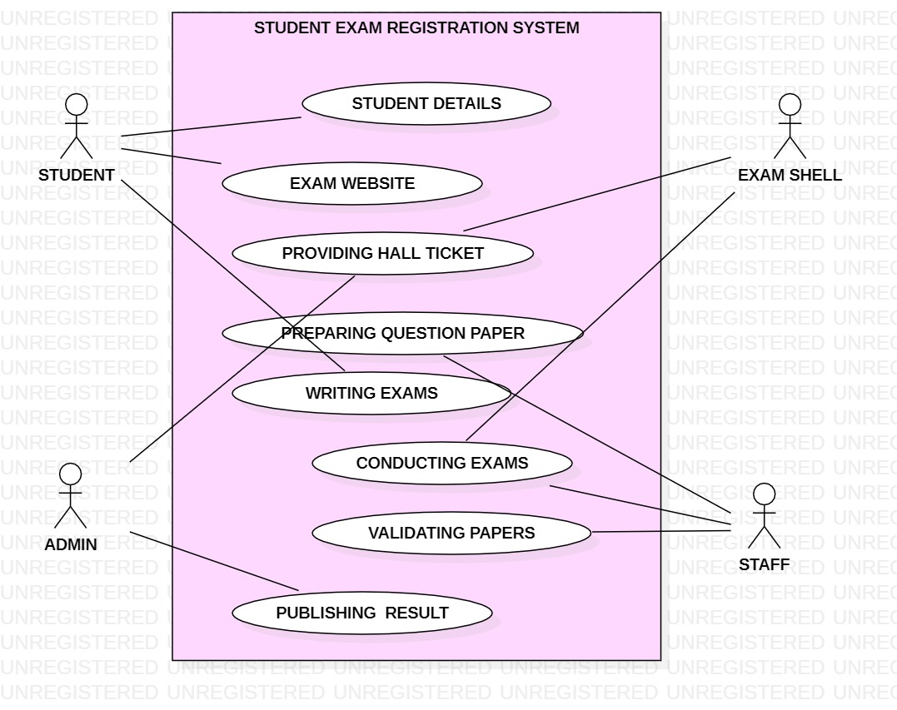
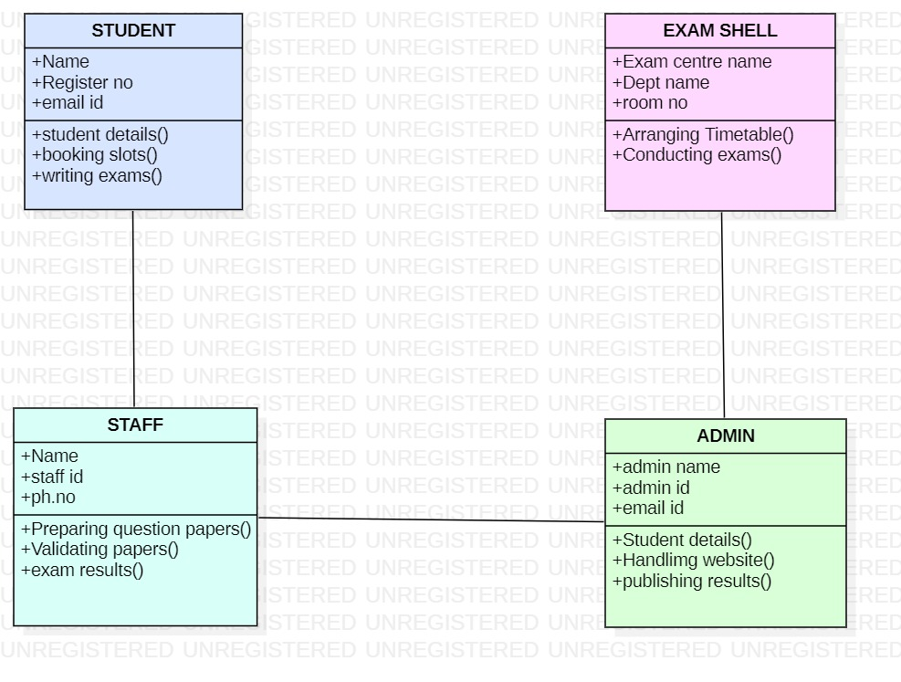
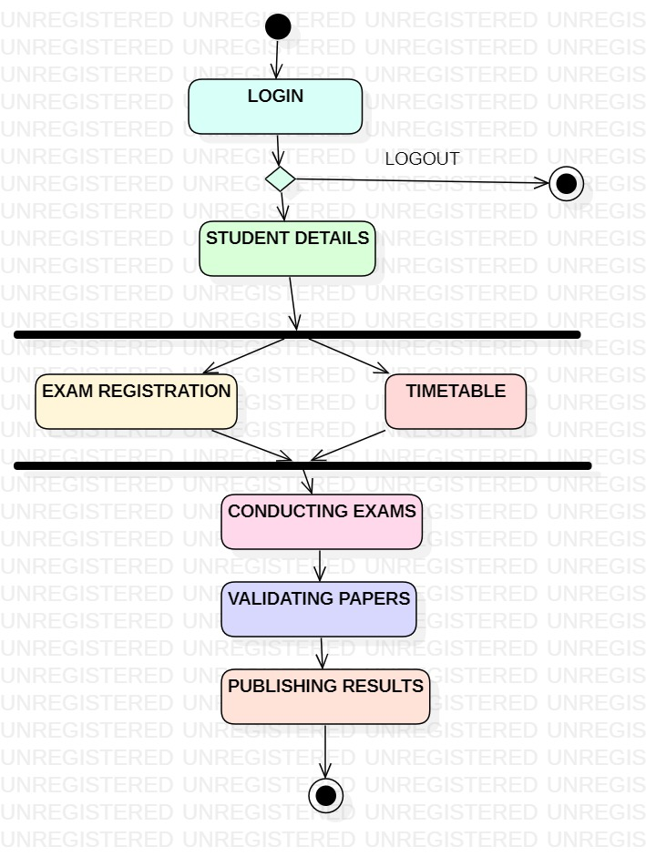
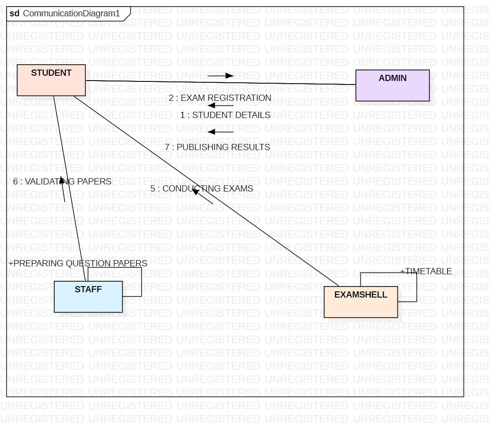
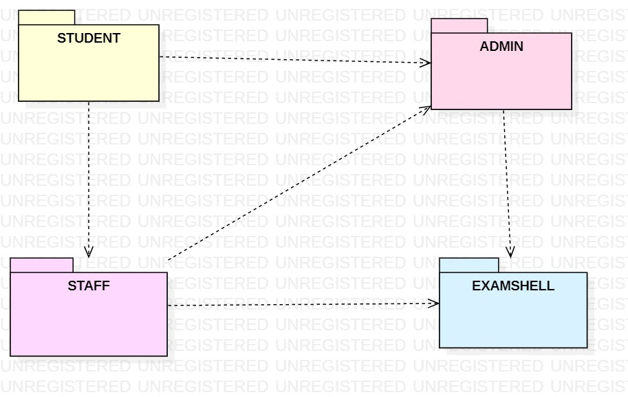
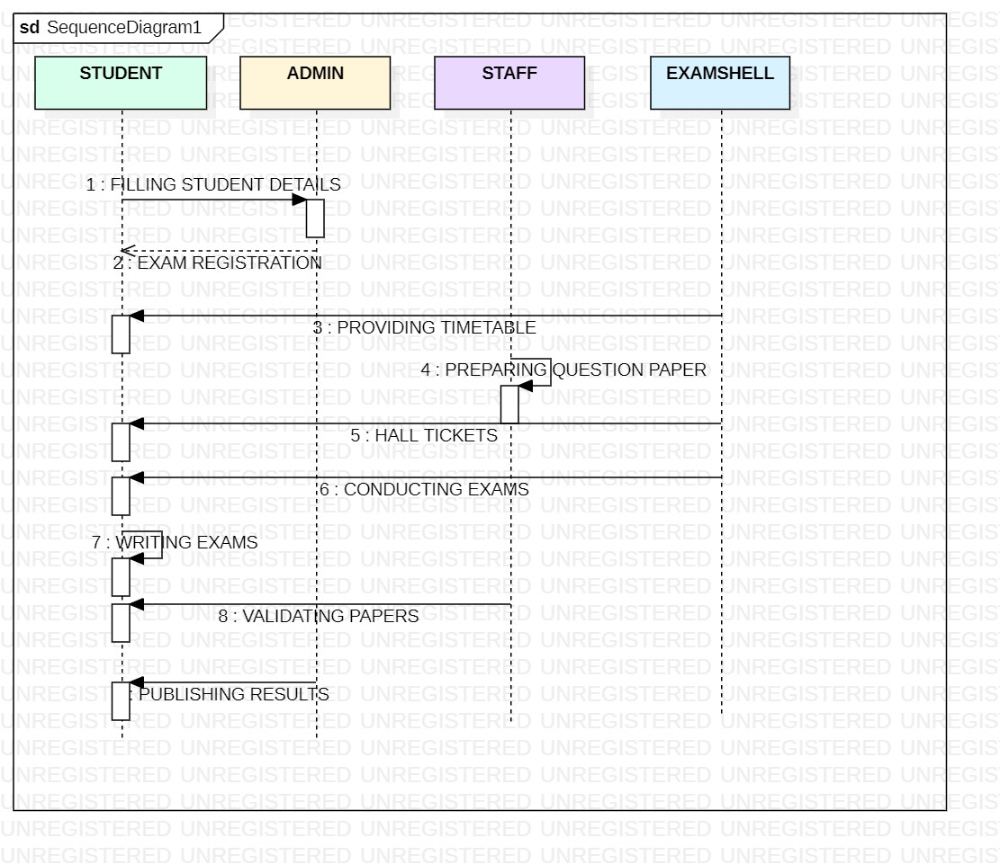

# Exp - 6 STUDENT ONLINE EXAM REGISTRATION SYSTEM

# AIM:
To draw the UML diagram for Student Online Exam Registration System.
# SRS (Procedure):
List of Programs:

(i) Usecase Diagram

(ii)Class Diagram

(iii)Activity Diagram

(iv)Communication Diagram

(v)Package Diagram

(vi)Sequence Diagram
# DIAGRAMS:
USE CASE DIAGRAM

CLASS DIAGRAM

ACTIVITY DIAGRAM

COMMUNICATION DIAGRAM

PACKAGE DIAGRAM

SEQUENCE DIAGRAM

# RESULT:
Thus, the Student Online Exam Registration System project was executed and the output was verified.

